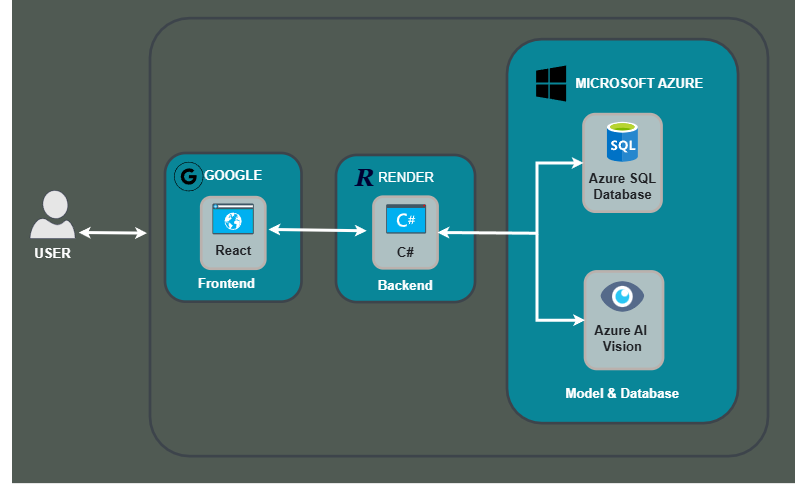

# ⊱ Riešenie jednoduchých rukopisných matematických príkladov ⊰

## Úvod:
  V tomto projekte je implementované rozpoznávanie textu a jednoduchých ručne písaných matematických príkladov pomocou služby Azure AI Vision. Systém extrahuje text z obrázkov a na pokyn používateľa identifikuje matematické výrazy a vykonáva ich výpočty. Riešenie je postavené na cloudových službách, čo zabezpečuje spoľahlivosť a škálovateľnosť. V prípade potreby je možné funkcionalitu jednoducho rozšíriť na zložitejšie úlohy rozpoznávania textu alebo riešenie konkrétnejších matematických problémov.

---

## 🛠️ Zvolené technológie:

- ⚛️ **React** – moderný JavaScriptový framework pre tvorbu dynamického a interaktívneho používateľského rozhrania.
- 🧠 **Azure Vision AI** – cloudová služba od Microsoftu na spracovanie obrazu a získavanie informácií pomocou umelej inteligencie.
- 💾 **Azure SQL Database** – relačná databáza poskytovaná Microsoft Azure pre bezpečné a škálovateľné uchovávanie používateľských dát.
- ☁️ **Google Cloud Services (Frontend)** – využité na nasadenie front-endovej časti aplikácie v cloude.
- 🔄 **Render (Backend)** – služba na jednoduché nasadenie a škálovanie backendu postaveného v C#.
- 💻 **C# (Backend)** – hlavný programovací jazyk pre spracovanie logiky a komunikáciu s databázou a modelom.

---

## 🔁 Diagram použitých služieb:

---

## 🧠 Princíp fungovania

1. **Používateľ nahrá obrázok** na stránku. Ak si želá získať nielen extrahovaný text, ale aj **vyriešenie príkladu**, označí to v špeciálnej časti stránky.
2. Obrázok sa **odosiela na server**, kde sa **spracuje pomocou modelu umelej inteligencie**, ktorý z neho extrahuje text.
3. Ak používateľ požaduje vyriešenie príkladu, extrahovaný text sa **posiela na validáciu a výpočet**.
4. **Validačný algoritmus** overí, či príklad spĺňa požadované kritériá, a **naformátuje ho** pre ďalšie spracovanie.
5. Výpočet príkladu prebieha pomocou **algoritmu spätnej poľskej notácie** – príklad sa rozdelí na jednotlivé prvky, usporiada podľa pravidiel notácie a následne vypočíta.
6. Pred zobrazením výsledkov používateľovi:
   - Obrázok sa **uloží na server aplikácie**, aby bol dostupný pre používateľa.
   - **Všetky výsledky spracovania** sa zapíšu do databázy pre možné ďalšie použitie.

---

## 👥 Rozdelenie práce:

- 🙍‍♂️ **Vladyslav Kalashnyk** – vývoj frontendu, pripojenie modelu a nastavenie neurónovej siete, organizácia pracovného procesu.
- 🙍‍♀️ **Polina Mykhailenko** – vývoj a údržba backendu, nasadenie backendu na cloudovú službu a hosting obrázkov.
- 🙍‍♂️ **Nazarii Sankovych** – hľadanie optimálneho modelu na rozpoznávanie textu, implementácia algoritmu na výpočet matematických príkladov, vedenie aktuálnej dokumentácie projektu.
- 🙍‍♀️ **Varvara Cherniavska** – vývoj validačného algoritmu pre príklady, nasadenie frontendu na cloudovú službu, pripojenie databázy.

---

## 🛠️ Návod na používanie aplikácie:

1. Otvorte si ľubovoľný internetový prehliadač.
2. Prejdite na webovú stránku aplikácie.
3. Nahrajte svoje **obrázok** s textom alebo matematickým príkladom.
4. Ak si želáte okrem extrahovaného textu získať aj riešenie príkladu, zaškrtnite možnosť „Získať riešenie“.
5. Výsledky sa zobrazia priamo na stránke.

## ▶️ Lokálne spustenie

Aby ste mohli spustiť aplikáciu lokálne, riaďte sa pokynmi uvedenými v súboroch:

- `server/README.md` – pokyny pre spustenie serverovej časti
- `client/README.md` – pokyny pre spustenie klientskej časti 

---
